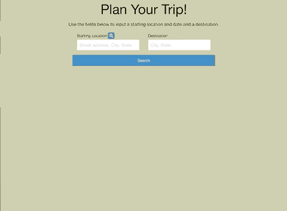

# Trip Planner

This application will help a user who wants to plan a road trip. The user will be able to enter their starting location and destination and will be given a list of hotels with prices at their destination, driving directions to the hotel they select, and a list of restaurants near their hotel.

## APIs used:

* TripAdvisor (Rapid API)- for hotel information
* Geohub (Rapid API)- for destination validation
* LocationIQ- geocoding to convert address to coordinates
* Geolocation API- retrieves user's location information
* Geoapify- builds custom maps and location
* Mapbox- provides navigation information
* US Restaurants API (Rapid API)- gets restaurant information at destination

## User Story
AS A user who wants to plan a road trip. 

I WANT to have a list of hotels to select from, driving directions to my selected hotel and restaurants near my hotel. 

SO THAT I can be more informed while planning my trip. 

## Acceptance Criteria
GIVEN I want to plan a road trip. 

WHEN I enter my destination and click 'Search'.

THEN I am given a list of hotels. 

WHEN I select a hotel. 

THEN I am given restaurant options near that hotel. 

WHEN I enter my starting location. 

THEN I am given driving directions from my location to the hotel I selected.

## Future Development
In the future, we plan to implement the following features when time allows:
 
 
For the hotel search, it would be useful to add the ability to search for hotels based on whether or not they have specific ammenities. 

For the driving directions, it would be useful to give the user the option to select places along their route to make stops and give them hotel and restaurant information at those stops. 

In addition to the restaurants returned to the user, it would be useful to also return additional attractions at the destination.

## Deployed Website
https://allendehoff.github.io/Project1/

